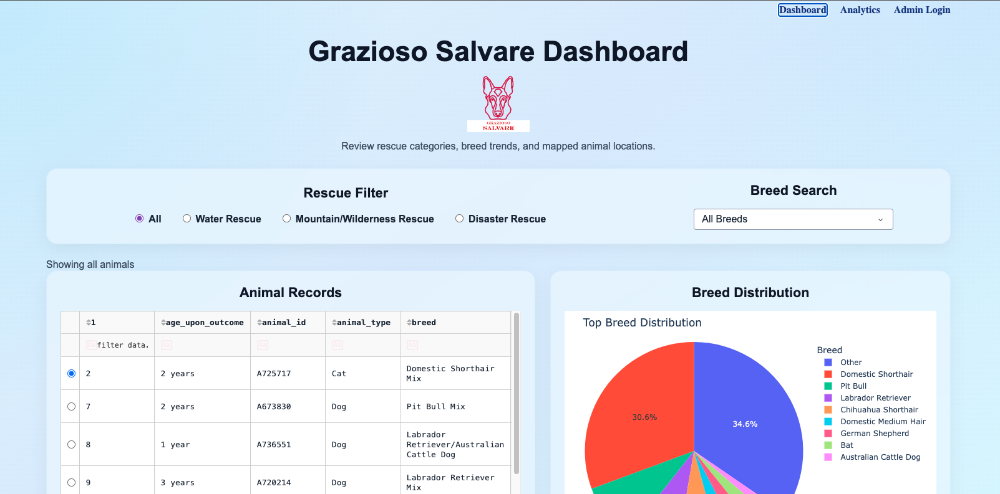
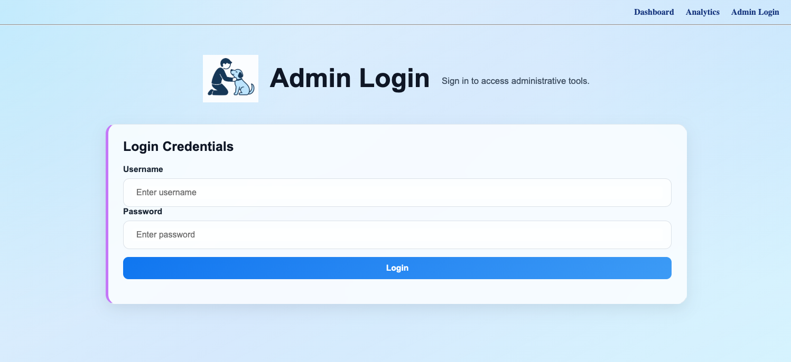
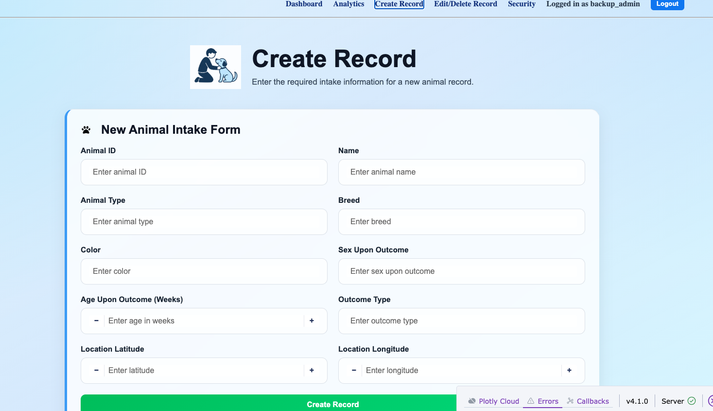
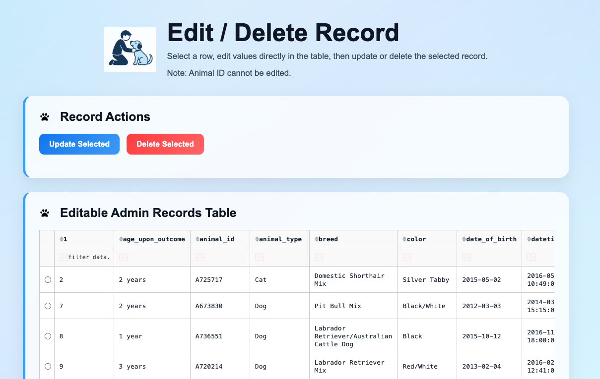

<h1>Artifact One</h1>

<h2>Software Design and Engineering</h2>

This artifact focuses on improving my Grazioso Salvare dashboard application through software design and engineering enhancements. The project was originally developed in a Jupyter Notebook for my CS-340 Client/Server Development course and connected to a MongoDB database. It included basic data filtering and visualization, along with a separate Python file used for CRUD operations and database access. The interface featured a geolocation map, scrollable data table, breed distribution chart, and radio button filters for rescue categories.

<h2>Enhancement Overview</h2>

I selected this project because it already functioned as a basic Dash application and gave me a strong starting point to build into something more complete. The original version showed that I could connect to MongoDB, manage data through CRUD operations, and create interactive visualizations. At the same time, it was limited by its structure and overall organization.

To address those limitations, I moved the project out of Jupyter and rebuilt it in Visual Studio Code. A major part of this enhancement was modularization. I separated the application into different components, including dashboard views, admin functionality, database access, and service layers. This made the code easier to manage and made it possible to add new features without breaking the parts that already worked.

I also expanded the application by adding an encrypted admin login system using password hashing, dedicated CRUD pages for managing records, multi-page navigation, and an analytics page for exploring data trends. These changes helped turn the original project into a more complete analytical web application that could better support Grazioso employees in managing animal shelter data.

<h2>Outcome Alignment</h2>

This enhancement aligns with the goals I outlined in my original capstone plan. I focused on improving how the application was organized by separating data retrieval, data processing, and visualization. I stayed close to my original plan, but I also expanded the project by adding features like the analytics page, admin authentication, CRUD functionality, and multi-page navigation. These additions improved the usability, organization, and overall functionality of the application.

<h2>Reflection</h2>

This enhancement helped me better understand how to take an existing project and turn it into a more complete and maintainable application. One of the biggest takeaways was the importance of modularization. Breaking the project into separate components made it much easier to manage, test, and expand.

I also saw how quickly complexity can grow when adding new features. Restructuring the application without breaking existing functionality was one of the main challenges, especially when working with Dash callbacks and data flow between components. This experience showed me the importance of planning structure early and staying focused on the core goals of the project.

Overall, this work strengthened my ability to design, organize, and expand a full application, which is directly applicable to real-world software development.

<h2>Screenshots</h2>

  

    
    

      Full dashboard showing filtering, mapping, and visualization features working together.
    

  

  

    
    

      Admin login required before accessing secure features.
    

  

  

    
    

      Create record form demonstrating structured data input.
    

  

  

    
    

      Edit and delete functionality for managing existing records.
    

  

